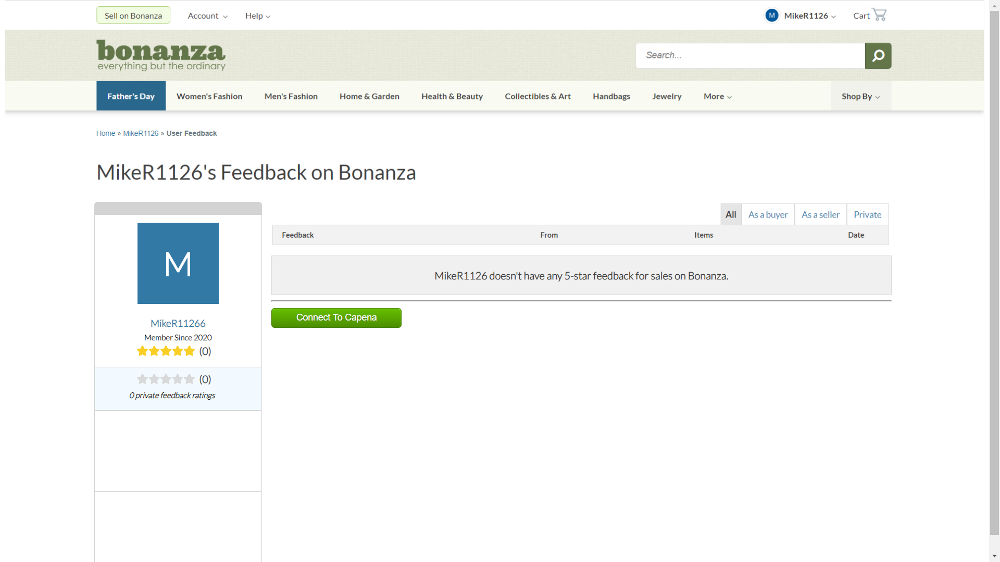
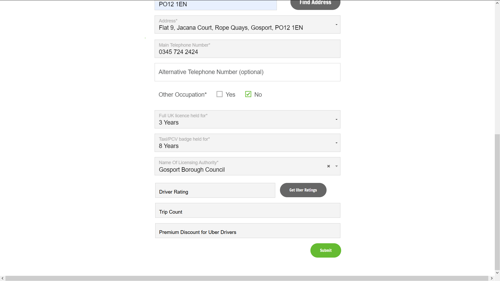

# capena-appia Quickstart

This is the Capena-APPIA demo application which allows users to import reputation data from eBay and Etsy (with more to follow)
and then to have those credentials issued as digitally signed transactions on the Hyperledger Indy ledger. Users' data are then stored in their digital wallets allowing for reuse (transferrence) of those credentials to downstream verifiers.

The Capena-APPIA demo shows the interaction between the users and those downstream platforms.

This application, the downtream APPIA plugin, consists of two React front end clients, and an expressjs server.

The Aries SSI agent communication uses the Trinsic API.

# ExpressJS Server

The server has routes for webhooks to process connection and proof request confirmations and routes for connecting and requesting credential verifications.

Currently the platforms supported in terms of requesting credential verifications are - Ebay  
 - Etsy - Uber

Proof requests are passed back to the client in the VerifyRecord.

# Install and Run ngrok and localhost.run
2.	Make sure all tunneling services are running and the correct URLs are in the .env files.

The idea here is that we need two tunneling clients running concurrently, one each for Bonanza and CleanGreen.

This has proved to be tricky; I have tried many different tunneling services and only found two that are reliable: ngrok and localtunnel.run

https://ngrok.com/

http://localhost.run/

ngrok will be used for Bonanza; localhost.run for cleangreen due to the limitation on the number of concurrent ngrok clients.

First, we need to set up ngrok clients in the ngrok config file:
Edit the file 
~/.ngrok2/ngrok.yml

Add the following lines:
authtoken: <YOUR NGROK AUTH TOKEN>
tunnels:
  delega:
    proto: http
    addr: https://localhost:3002
  bonanza:
    proto: http
    addr: 5002

Where port 5002 is the port for the Bonanza express server.

Then start the service using:
./ngrok start -all

For APPIA we also need the localhost.run service to be running. This should be launched with the command

ssh -o ServerAliveInterval=60 -R 80:localhost:4002 ssh.localhost.run

(Where port 4002 is the express port for CleanGreen)

Add the two URLs (ngrok and localhost.run to the APPIA .env file:

CLEANGREEN_LOCALHOST_URL='http://mike-d6daf9b7.localhost.run'

BONANZA_NGROK_URL='http://c023412b06da.ngrok.io'

### Android

1.  If you are using Android, download the app "Streetcred identity wallet" from Play Store

### See Capena-Delega for how to run that application and issue credentials to the Trinsic mobile wallet app.

# Bonanza Client

### Requesting Credential Verification: Bonanza

Connect to Capena.

This is a connection invitation. Webhooks will automatically issue the User Details credential once this is scanned

-   Accept the connetion

Click on "connect to capena" and scan the QR Code.

Once the import buttons appear you can import credentials from eBay or Etsy. Accept the proof request on the phone. If more than one credential is availale, select the one that applies (the most recent). If the credentials are revoked then "REVOKED" will appear across the credentials to notify the user.

### Requesting Credential Verification: CleanGreenCompar

# GreenCleanCompare Client

Click on "Get Uber Ratings".

Once the QR Code appears, scan the code. A proof request appears at the phone. Select the most recent one and hit accept.

The Uber driver ratings will be displayed on the form along with a possible insurance premium discount.
